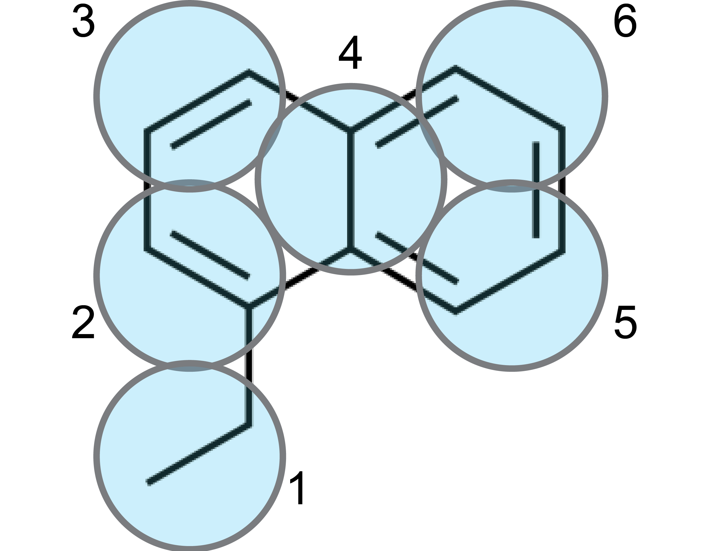
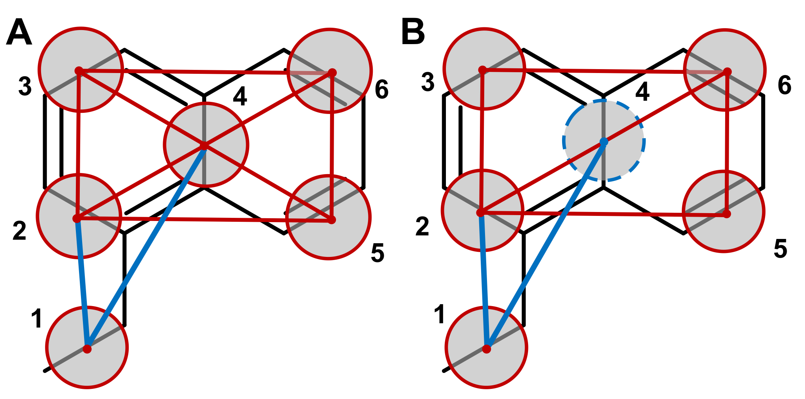
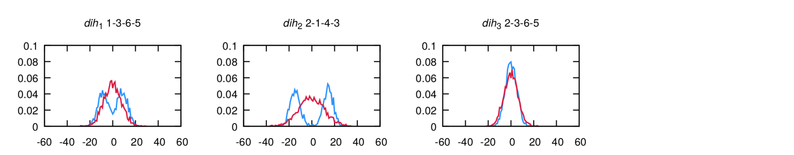
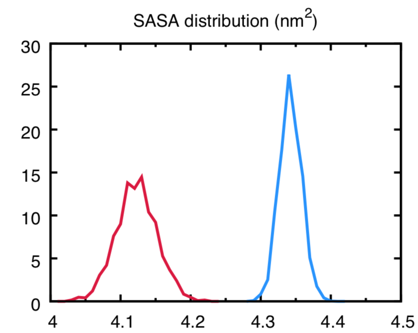
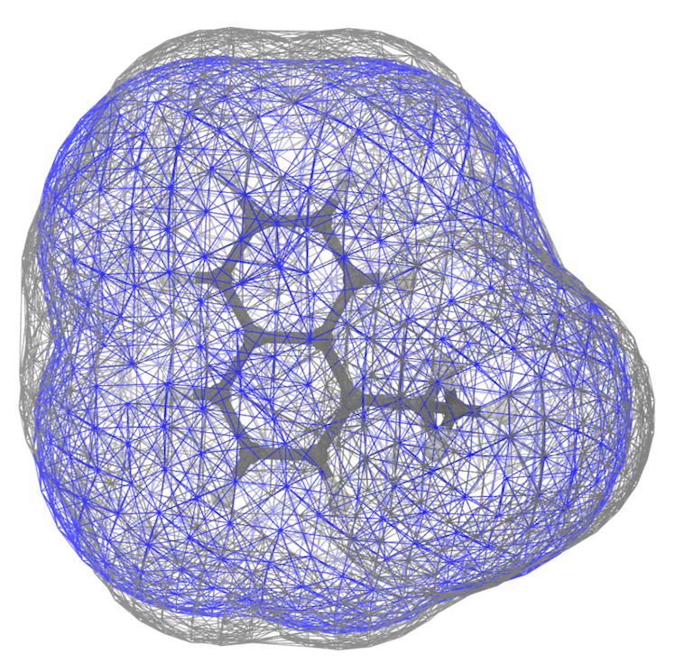
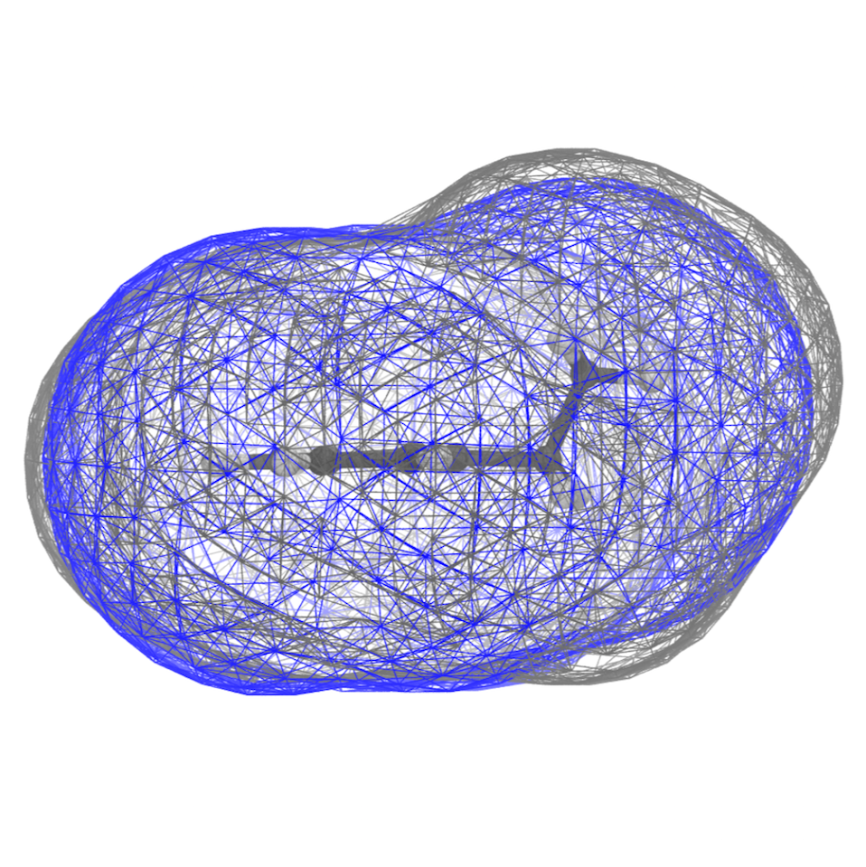
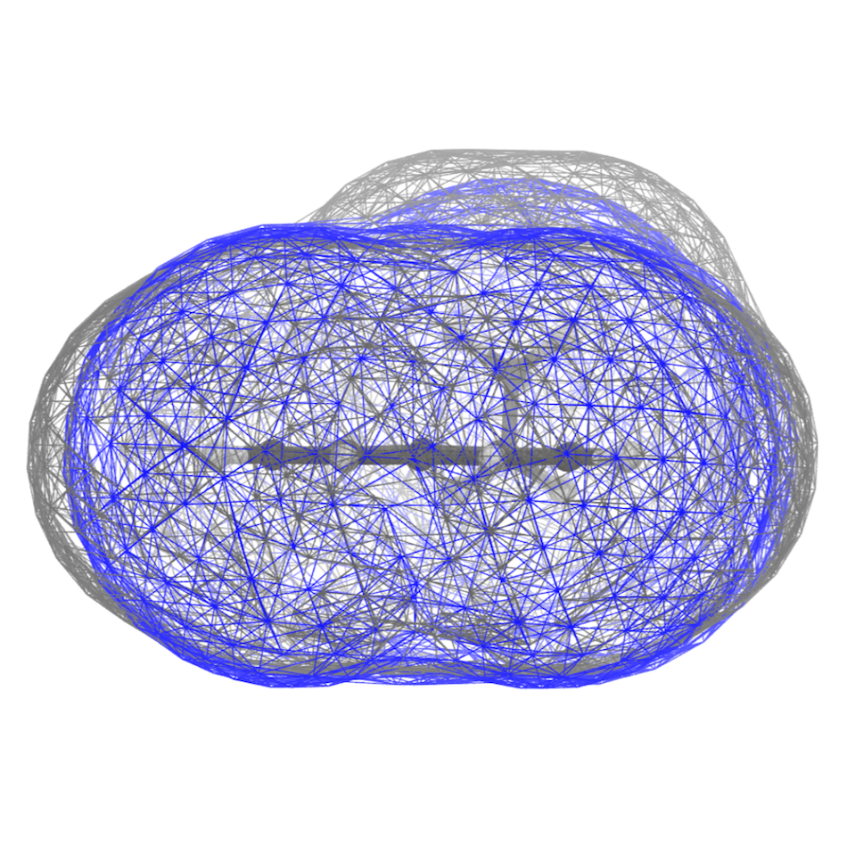

----
### Martini 3 tutorials: parametrization of a new small molecule
----

---

<p style="font-family: Courier New, monospace;">Version: 1.0.1<br>
Contributed by: <a href="https://github.com/ricalessandri">@ricalessandri</a>, <a href="https://github.com/Lp0lp">@Lp0lp</a>, <a href="https://github.com/paulocts">@paulocts</a>.</p>

---

Files required and worked examples for this tutorial can be downloaded [here](https://github.com/ricalessandri/Martini3-small-molecules/blob/main/tutorials/files-m3-newsm.zip).

<h2 style="text-align: left;"><span style="font-size: 14pt;">Table of contents</span></h2>

<p style="text-align: left;"><a href="#Introduction">Introduction</a></p>
<p style="text-align: left;"><a href="#1) Generate atomistic reference data">1) Generate atomistic reference data</a></p>
<p style="text-align: left;"><a href="#2) Atom-to-bead mapping">2) Atom-to-bead mapping</a></p>
<p style="text-align: left;"><a href="#3) Generate the CG mapped trajectory from the atomistic simulation">3) Generate the CG mapped trajectory from the atomistic simulation</a></p>
<p style="text-align: left;"><a href="#4) Create the initial CG &lt;code&gt;itp&lt;/code&gt; and &lt;code&gt;tpr&lt;/code&gt; files">4) Create the initial CG <code>itp</code> and <code>tpr</code> files</a></p>
<p style="text-align: left;"><a href="#5) Generate target CG distributions from the CG mapped trajectory">5) Generate target CG distributions from the CG mapped trajectory</a></p>
<p style="text-align: left;"><a href="#6) Create the CG simulation">6) Create the CG simulation</a></p>
<p style="text-align: left;"><a href="#7) Optimize CG bonded parameters">7) Optimize CG bonded parameters</a></p>
<p style="text-align: left;"><a href="#8) Comparison to experimental results, further refinements, and final considerations">8) Comparison to experimental results, further refinements, and final considerations</a></p>
<p style="text-align: left;"><a href="#References and notes">References and notes</a></p>


<h2 style="text-align: left;"><a name="Introduction"></a>Introduction</h2>

In this tutorial, we will discuss how to build a Martini 3 topology for a new small molecule. 
The aim is to have a pragmatic description of the Martini 3 coarse-graining (CGing) principles described in Refs. 
[[1]](https://doi.org/10.1038/s41592-021-01098-3) and [[2]](https://doi.org/10.33774/chemrxiv-2021-1qmq9), 
which follow the main ideas outlined in the seminal Martini 2 work [[3]](https://pubs.acs.org/doi/abs/10.1021/jp071097f). 
Among other things, you may want to parametrize a small molecule with Martini 3 in order to perform protein-ligand 
binding simulations [[4]](https://doi.org/10.33774/chemrxiv-2021-1qmq9) or perhaps test the solubility of a molecular 
dopant in different environments [[5]](https://doi.org/10.1002/adma.201704630). 

This tutorial is based on the analogous 
[Martini 2 tutorial](http://cgmartini.nl/index.php/tutorials-general-introduction-gmx5/parametrzining-new-molecule-gmx5) 
but takes into account some important aspects which changed in Martini 3. We will use as an example 
the molecule *1-ethylnaphthalene*, and make use of Gromacs versions 2019.x or later.

<p align="center">

</p>


<h2 style="text-align: left;"><a name="1) Generate atomistic reference data"></a>1) Generate atomistic reference data</h2>

We will need atomistic reference data to extract bonded parameters for the CG model. 
Note that we will need all the hydrogen atoms to extract bond lengths further down this tutorial, 
so make sure that your atomistic structure contains all the hydrogens. 
      
Here, we will use the [LigParGen server](http://zarbi.chem.yale.edu/ligpargen/) [6] as a way to obtain an atomistic (or all-atom, AA) 
structure and molecule topology based on the OPLS-AA force field, but of course feel free to use your favorite atomistic force field. 
Other web-based services such as the [automated topology builder (ATB)](https://atb.uq.edu.au/) or [CHARMM-GUI](https://www.charmm-gui.org/) 
can also be used to obtain reference topologies based on other AA force fields. Another important option is to look in the literature 
for atomistic studies of the molecule you want to parametrize: if you are lucky, somebody might have already published 
a validated atomistic force field for the molecule, which you can then use to create reference atomistic simulations.
      
Start by feeding the SMILES string for *1-ethylnaphthalene* (namely, `CCc1cccc2ccccc21`) to the LigParGen server, 
and pick the "1.14\*CM1A-LBCC (Neutral molecules)" charge model (nothing special about this choice of charge model). 
After submitting the molecule, the server will generate input parameters for several molecular dynamics (MD) packages. 
Download the structure file (PDB) as well as the OPLS-AA topology in the GROMACS format (TOP) and rename 
them `ENAP_LigParGen.pdb` and `ENAP_LigParGen.itp`, respectively. You can now unzip the zip archive provided:
      
```
unzip  files-m3-newsm.zip
```

which contains a folder called `ENAP-in-water` that contains some template folders and useful scripts. 
We will assume that you will be carrying out the tutorial using this folder structure and scripts. Note that the archive 
contains also a folder called `ENAP-worked` where you will find a worked version of the tutorial (trajectories not included). 
This might be useful to use as reference to compare your files  (*e.g.*, to compare the `ENAP_LigParGen.itp` 
you obtained with the one you find in `ENAP-worked/1_AA-reference`).

We can now move to the first subfolder, `1_AA-reference`, and copy over the files you just obtained from the LigParGen server:

```
cd     ENAP-in-water/1_AA-reference
[move here the obtained ENAP_LigParGen.pdb and ENAP_LigParGen.itp files]
```

Input files obtained from LigParGen may come with unknown residue names. Before launching the AA MD simulation, 
we will substitute the `UNK` residue name by `ENAP`. To do so, open the `ENAP_LigParGen.pdb` with your text editor of choice 
and replace the `UNK` entries on the 4th column of the ATOM records section. This column defines the residue name on a PDB file. 
Now open the `ENAP_LigParGen.itp` file and replace the `UNK` entries under the `[ moleculetype ]` directive and on the 4th column 
of the `[ atoms ]` directive. These define the residue name in a GROMACS topology file. (A lengthier discussion on GROMACS topology files 
will be given in section **4)**.) Alternatively, the following command - that relies on the Unix utility `sed` - will replace 
any `UNK ` occurrence with `ENAP` (note the extra space after `UNK` which is important to keep the formatting of the `pdb` file!):

```
sed -i 's/UNK /ENAP/' ENAP_LigParGen.pdb
sed -i 's/UNK /ENAP/' ENAP_LigParGen.itp
```

Now launch the AA MD simulation:

```
bash prepare_1mol_AA_system.sh  ENAP_LigParGen.pdb  spc216.gro  SOL  3
```
The last command will run an energy-minimization, followed by an NPT equilibration of 250 ps, and by an MD run of 10 ns 
(inspect the script and the various `mdp` files to know more). 
Note that 10 ns is a rather short simulation time, selected for speeding 
up the current tutorial. You should rather use at least 50 ns, 
or an even longer running time in case of more complex molecules 
(you can try to experiment with the simulation time yourself!).
In this case, the solvent used is water; however, the script 
can be adapted to run with any other solvent, provided that you input also an equilibrated solvent box. You should choose 
a solvent that represents the environment where the molecule will spend most of its time.


<h2 style="text-align: left;"><a name="2) Atom-to-bead mapping"></a>2) Atom-to-bead mapping</h2>

Mapping, *i.e.*, splitting the molecule in building blocks to be described by CG beads, is the heart of coarse-graining and relies 
on experience, chemical knowledge, and trial-and-error. Here are some guidelines you should follow when mapping a molecule to a Martini 3 model:
   
   - only non-hydrogen atoms are considered to define the mapping;
   - avoid dividing specific chemical groups (*e.g.*, amide or carboxylate) between two beads;
   - respect the symmetry of the molecule; it is moreover desirable to retain as much as possible the volume and shape of the underlying AA structure;
   - default option for 4-to-1, 3-to-1 and 2-to-1 mappings are regular (R), small (S), and tiny (T) beads; 
     they are the default option for linear fragments, *e.g.*, the two 4-to-1 segments in octane;
   - R-beads are the best option in terms of computational performance, with the bead size reasonably good to represent 4-to-1 linear molecules;
   - T-beads are especially suited to represent the flatness of aromatic rings;
   - S-beads usually better mimic the "bulkier" shape of aliphatic rings;
   - the number of beads should be optimized such that the maximum mismatch in mapping is ±1 non-hydrogen atom 
     per 10 non-hydrogen atoms of the atomistic structure;
   - fully branched fragments should usually use beads of smaller size (the rational being that the central atom 
     of a branched group is buried, that is, it is not exposed to the environment, reducing its influence on the interactions); 
     for example, a neopentane group contains 5 non-hydrogen atoms but, as it is fully branched, you can safely model it as a regular bead.
   
In this example, first of all it is important to realize that, within Martini 3, conjugated, atom-thick structures 
are best described by Tiny (T) beads. This ensures packing-related properties closely matching atomistic data 
[[1]](https://doi.org/10.1038/s41592-021-01098-3)-[[2]](https://doi.org/10.33774/chemrxiv-2021-1qmq9). 
In this case, the 10 carbon atoms of the naphthalene moiety are therefore mapped to 5 T-beads, as shown in the figure below:
   
<p align="center">

</p>

Which leaves us with the ethyl group. A T-bead is again a good choice because the T-bead size is suited for describing 
2 non-hydrogen atoms. Note that, the beads have also been numbered in the figure for further reference.
   
A good idea to settle on a mapping is to draw your molecule a few times on a piece of paper, come up with several mappings, 
compare them, and choose the one that best fulfills the guidelines outlined above.
   
   
<h2 style="text-align: left;"><a name="3) Generate the CG mapped trajectory from the atomistic simulation"></a>3) Generate the CG mapped trajectory from the atomistic simulation</h2>

Using the mapping you just created, you will now transform the simulation you did at **1)** to CG resolution. One way to 
do this is by creating a Gromacs (AA-to-CG) index file where every index group stands for a bead and contains the mapped atom numbers. 

Instead of creating an index file by hand from scratch, an initial AA-to-CG index file can be obtained with the 
[CGbuilder tool](https://jbarnoud.github.io/cgbuilder/) [7]. The intuitive GUI allows to map a molecule on the virtual environment 
almost as one does on paper. Just load the atomistic pdb/gro file of the molecule, click on the atoms you want to be part of the first bead, 
click again to remove them if you change your mind, create the next bead by clicking on the "new bead" button, and so on; 
finally, download the files once done. In fact, the tool allows also to obtain an initial CG configuration (a `.gro` file) 
for the beads and a CG-to-AA mapping file (a `.map` file) based on the chosen mapping. Doesn't this sound better than traditional paper?! 
Current caveats of CGbuilder include the fact that atoms cannot contribute with a weight different from 1 to a certain bead, something 
which is sometimes needed when mapping atomistic structures to Martini. In such cases, 
the index and/or mapping files should be subsequently refined by hand.

Before you get to it: an **important change with respect to Martini 2.x** is the fact that now *hydrogen atoms* 
are taken into account to determine the relative position of the beads when mapping an atomistic structure to CG resolution 
[[1]](https://doi.org/10.1038/s41592-021-01098-3)-[[2]](https://doi.org/10.33774/chemrxiv-2021-1qmq9) - more on this later in this Section. 
This should be reflected in your AA-to-CG index file, that is, your index should also contain the hydrogens 
(in CGbuilder terms, click also on the hydrogens!). 
The general rule is to map a certain hydrogen atom to the bead which contains the non-hydrogen atom it is attached to.

You can now try to map the `ENAP_LigParGen.pdb` via CGbuilder. Once done, download the files that CGbuilder 
creates - `ndx`, `map`, and `gro` - to the `2_atom-to-bead-mapping` folder:

```
cd ../2_atom-to-bead-mapping/
[download cgbuilder.ndx, cgbuilder.map, and cgbuilder.gro and move them to the current folder, i.e., '2_atom-to-bead-mapping']
```

and compare the files obtained to the ones provided 
in `ENAP-worked/2_atom-to-bead-mapping` where, besides the files we just explained, you can also find a screenshot 
(`ENAP_cgbuilder.png`) of the mapping as done with the CGbuilder tool. **Note** also that the files provided assume the beads 
**to be ordered in the same way as shown in the Figure of Section** **2)**; it is hence recommended to use the same order to greatly facilitate comparisons.

After having populated your own `ENAP-in-water/2_atom-to-bead-mapping` subfolder with - at least - the `ndx` file (let's call it 
`ENAP_oplsaaTOcg_cgbuilder.ndx`), move to the folder `3_mapped` and copy over the index (we just rename it to `mapping.ndx`), that is:

```
cd  ../3_mapped
cp  ../2_atom-to-bead-mapping/ENAP_oplsaaTOcg_cgbuilder.ndx  mapping.ndx
```

Now, we took into account the hydrogens because 
**center of geometry (COG)-based mapping of AA structures, done *taking into account the hydrogen atoms*, constitutes the standard procedure for obtaining bonded parameters in Martini 3** 
[[1]](https://doi.org/10.1038/s41592-021-01098-3)-[[2]](https://doi.org/10.33774/chemrxiv-2021-1qmq9). 
Hence, we need to consider the hydrogens when mapping the AA structure to CG resolution. Because of a `gmx traj` 
unexpected behavior (a potential bug, see note [8]), if we want to stick to `gmx traj` 
([like in the good ol' days](http://cgmartini.nl/index.php/tutorials-general-introduction-gmx5/parametrzining-new-molecule-gmx5); 
alternatives include, *e.g.*, using the [MDAnalysis](https://www.mdanalysis.org/) Python library), 
we need a little hack before being able to run `gmx traj`. Namely, we need to first create an AA `tpr` file with the atoms 
of the atomistic structure all having the *same mass*. To do this, still from the `3_mapped` folder, 
create a new `itp` with the modified masses:

```
cp  ../1_AA-reference/ENAP_LigParGen.itp  ENAP_LigParGen_COG.itp
```

Open `ENAP_LigParGen_COG.itp` with your text editor of choice and change the values on the 8th column under 
the `[ atoms ]` directive to an equal value (of, for example, `1.0`). This column defines the atom mass in a GROMACS topology file. 
Now prepare a new `top` file which includes it:
	
```
cp  ../1_AA-reference/system.top                      system_COG.top
sed -i 's/ENAP_LigParGen.itp/ENAP_LigParGen_COG.itp/' system_COG.top
```

You can now run the script:

```
bash 3_map_trajectory_COG.sh
```
which will:
	
1. first make sure that the AA trajectory is *whole*, *i.e*., your molecule of interest is not split by the periodic boundary 
   conditions in one or more frames in the trajectory file (the `gmx trjconv -pbc whole ...` command);
2. subsequently create a `AA-COG.tpr`, which will be used for the COG mapping in the following step (the `gmx grompp -p ...` command);
3. finally, map the AA trajectory to CG resolution: the `gmx traj -f...` command contained in `3_map_trajectory_COG.sh` 
   will do COG-mapping because it uses the `AA-COG.tpr`.
   

<h2 style="text-align: left;"><a name="4) Create the initial CG &lt;code&gt;itp&lt;/code&gt; and &lt;code&gt;tpr&lt;/code&gt; files"></a>4) Create the initial CG <code>itp</code> and <code>tpr</code> files</h2>

GROMACS `itp` files are used to define components of a topology as a separate file. In this case we will create one to define 
the topology for our molecule of interest, that is, define the atoms (that, when talking about CG molecules, are usually called *beads*), 
atom types, and properties that make up the molecule, as well as the bonded parameters that define how the molecule is held together. 

The creation of the CG `itp` file has to be done by hand, although some copy-pasting from existing `itp` files might help in getting 
the format right. A thorough guide on the GROMACS specification for molecular topologies can be found in the 
[GROMACS reference manual](https://manual.gromacs.org/documentation/current/reference-manual/topologies/topology-file-formats.html), 
however, this tutorial will guide you through the basics.

The first entry in the `itp` is the `[ moleculetype ]`, one line containing the molecule name and the number of nonbonded interaction exclusions. 
For Martini topologies, the standard number of exclusions is 1, which means that nonbonded interactions between particles directly 
connected are excluded. For our example this would be:

```
[ moleculetype ]
; molname    nrexcl
  ENAP         1
```

The second entry in the `itp` file is `[ atoms ]`, where each of the particles that make up the molecule are defined. 
One line entry per particle is defined, containing the *beadnumber*, *beadtype*, *residuenumber*, *residuename*, *beadname*, 
*chargegroup*, *charge*, and *mass*. For each bead we can freely define a beadname. The residue number and residue name will 
be the same for all beads in small molecules, such as in this example. 

In Martini, we must also assign a bead type for each of the beads. This assignment follows the "Martini 3 Bible" (from Refs. 
[[1]](https://doi.org/10.1038/s41592-021-01098-3) and [[2]](https://doi.org/10.33774/chemrxiv-2021-1qmq9)), 
where initial bead types are assigned based on the underlying chemical building blocks. **You can find the "Martini 3 Bible" in the form of a table** 
**[at this link](https://github.com/ricalessandri/Martini3-small-molecules/blob/main/tutorials/building_block_table.pdf)**. 
In this example, bead number 1 represents the ethyl group substituent; according to the "Martini 3 Bible" ethyl groups are represented 
by TC3 beads. Check the table yourself to see which bead types to use to describe the remaining beads. 
For a lengthier discussion of bead choices, see the final section of this tutorial.

Each bead will also have its own charge, which in this example will be 0 for all beads. Mass is usually not specified in Martini; 
in this way, default masses of 72, 54, and 36 a.m.u. are used for R-, S-, and T-beads, respectively. However, 
when defined the mass of the beads is typically the sum of the mass of the underlying atoms.

For our example, the atom entry for our first bead would be:

```
[ atoms ]
; nr type resnr residue atom cgnr charge mass
   1  TC2   0    ENAP   C1    1    0     
...
```
 
These first two entries in the `itp` file are mandatory and make up a basic `itp`. Finish building your initial CG `itp` entries 
and name the file `ENAP_initial.itp`. The `[ moleculetype ]` and `[ atoms ]` entries are typically followed by entries which define 
the bonded parameters: `[ bonds ]`, `[ constraints ]`, `[ angles ]`, and `[ dihedrals ]`. For now, you do not need to care about 
the bonded entries, have a look at the next section (**5)**) for considerations about which bonded terms you will need and how to define them. 

Before going onto the next step, we need a CG `tpr` file to generate the distributions of the bonds, angles, and dihedrals 
from the mapped trajectory. To do this, move to the directory `4_initial-CG`, where you should place the `ENAP_initial.itp` 
and that also contains a `system_CG.top`, the `martini_v3.0.0.itp` and a `martini.mdp` and run the script:

```
cd   4_initial-CG
bash 4_create_CG_tpr.sh
```

The script will:

1. extract one frame from your trajectory (mapping it to CG resolution, of course);
2. use the frame, along with the `top` and `mdp` files 
   ([see examples of the latter on the website](http://cgmartini.nl/index.php/force-field-parameters/input-parameters)) 
   to create a `CG.tpr` file for your molecule.


<h2 style="text-align: left;"><a name="5) Generate target CG distributions from the CG mapped trajectory"></a>5) Generate target CG distributions from the CG mapped trajectory</h2>

We need to obtain the parameters of the bonded interactions 
(bonds, constraints, angles, proper and improper dihedrals) which we want in our CG model from our mapped-to-CG atomistic 
simulations from step **3)**. However, *which* bonded terms do we need to have? Let's go back to the drawing table and 
identify between which beads there should be bonded interactions.

#### 5.1) On the choice of bonded terms for the CG model 

The bonds connecting the T-beads within the 1-ethyl-naphthalene moiety are most likely going to be very stiff, that is, 
their distributions are going to be very narrow. This calls for the use of constraints 
[[1]](https://doi.org/10.1038/s41592-021-01098-3)-[[3]](https://pubs.acs.org/doi/abs/10.1021/jp071097f). 
A "naive" way of putting the model together would be to constrain all the beads (see Figure A below):

<p align="center">

</p>

such a model, however, is prone to numerical instabilities, because it is increasingly complicated 
for the constraint algorithm to satisfy a growing number of connected constraints. Another option is to build a "hinge" model 
[[2]](https://doi.org/10.33774/chemrxiv-2021-1qmq9) (inspired by the work of Melo *et al.* 
[[9]](http://dx.doi.org/10.1063/1.4937783])) where the 4 external beads (beads 2, 3, 5, and 6 of the Figure) are connected 
by 5 constraints to form a "hinge" construction, while the central bead (bead number 4) is described as a 
virtual site, that is, a particle whose position is completely defined by its constructing particles 
(Figure B above). The **use of virtual particles** not only improves the numerical stability 
of the model but also improves performance [[2]](https://doi.org/10.33774/chemrxiv-2021-1qmq9). As virtual sites are mass-less, 
the mass of the virtual site should be shared among the four constructing beads, so that beads 2, 3, 5, and 6 
should have each a mass of 45 (= 36 + 36/4, where 36 is the mass of a T-bead).

Bead 1 can then be connected by means of two bonds, namely 1-2 and 1-4. Two improper dihedrals (1-3-6-5 and 2-1-4-3) 
will be required in order to keep bead 1 on the right position onto the naphthalene ring. A final improper dihedral 2-3-6-5 
will also be needed to keep the naphthalene ring flat. Exclusions between all beads should also be applied in this case, 
as the molecule is quite stiff and having intramolecular interactions in this case is not needed. 

Having decided on the bonded terms to use, they must now be defined in the `itp` file 
under the `[ bonds ]`, `[ constraints ]`, `[ angles ]`, `[ dihedrals ]`, and `[ virtual_sitesn ]` entries. 
In general, each bonded potential is defined by stating the atom number of the particles involved, 
the type of potential involved, and then the parameters involved in the potential, such 
as reference bond lengths/angle values or force constants. This definition is highly dependent 
on the type of potentials employed and, as such, users should always reference the 
[GROMACS manual for specific details](https://manual.gromacs.org/documentation/current/reference-manual/topologies/topology-file-formats.html). 
Here, we will use this example to cover the most common potentials used in defining Martini topologies. 

Bonds are defined under `[ bonds ]` by stating the atom number of the particles involved, 
the type of bond potential (in this case, type 1, a regular harmonic bond) followed by 
the reference bond length and force constant. Constraints are defined similarly to bonds, 
under the `[ constraints ]` section, with the exception that no force constant is needed. 
If we use bond 1-2 and constraint 2-3 as examples, your `itp` should look something like this:

```
[bonds]
; i  j  funct length    kb
  1  2   1     0.260   20000 
...
```
```
[constraints]
; i  j  funct length
  2  3   1     0.260 
...
```

Angles and dihedrals follow the same strategy, stating the atom number of the particles involved, 
the type of potential, and, in this case, the reference angle and force constant. While there 
are no angles defined in this example, we have 3 improper dihedral potentials in place (regular 
and improper dihedral potentials correspond to dihedral function types 1 and 2, respectively):

```
[ dihedrals ]
; improper
; i j k l  funct  ref.angle force_k
  1 3 6 5    2        0        10  
...
```

Virtual sites are defined slightly differently. In this case, you define the atom number 
of the virtual site, followed by the type of virtual site, and the atom numbers 
of the constructing particles. In our case:

```
[ virtual_sitesn ]
; site funct  constructing atom indices
   4     1     2 3 5 6
```

Finally, to apply exclusions, we state the atom number of the target particle followed 
by the numbers of the atoms from which the target particle is to be excluded:

```
[ exclusions ]
 1 2 3 4 5 6
...
```

Using initial guesses for the reference bond lengths/angles and force constants 
you can now create a complete topology for the target molecule. These initial guesses will be 
improved upon in a further section by comparing the AA and CG bonded distributions and adjusting these values.


#### 5.2) Index files and generation of target distributions

Once you have settled on the bonded terms, create index files for the bonds with a directive `[bondX]` for each bond, 
and which contains pairs of CG beads, for example:

```
[bond1]
  1  2
[bond2]
  1  4
...
```

and similarly for angles (with triples of CG beads) and dihedrals (with quartets). Write scripts that generate 
distributions for all bonds, angles, and dihedrals you are interested in. For 1-ethyl-naphthalene, 
there are seven bonds (5 constraints and 2 bonds) and three dihedrals, as discussed. A script is also provided, so that:

```
cd  ENAP-in-water/5_target-distr
[create bonds.ndx and dihedrals.ndx]
bash 5_generate_target_distr.sh
```

will create the distributions. Inspect the folders `bonds_mapped`, and `dihedrals_mapped` for the results. 
You will find each bond distributions as `bonds_mapped/distr_bond_X.xvg` and a summary of the mean and standard deviations 
of the mapped bonds as `bonds_mapped/data_bonds.txt`.

For each bond, the script uses the following command (in this example, the command is applied for the first bond, whose index is 0):

```
echo 0 | gmx distance -f ../3_mapped/mapped.xtc -n bonds.ndx -s ../4_initial-CG/CG.tpr -oall bonds_mapped/bond_0.xvg -xvg none
gmx analyze -f bonds_mapped/bond_0.xvg -dist bonds_mapped/distr_bond_0.xvg -xvg none -bw 0.001
```

and similarly for the first dihedral:

```
echo 0 | gmx angle -type dihedral -f ../3_mapped/mapped.xtc -n dihedrals.ndx -ov dihedrals_mapped/dih_0.xvg
gmx analyze -f dihedrals_mapped/dih_0.xvg -dist dihedrals_mapped/distr_dih_0.xvg -xvg none -bw 1.0
```


<h2 style="text-align: left;"><a name="6) Create the CG simulation"></a>6) Create the CG simulation</h2>

We can now finalize the first take on the CG model, `ENAP_take1.itp`, where we can use the info contained in the `data_bonds.txt` 
and `data_dihedrals.txt` files to come up with better guesses for the bonded parameters:

```
cd ENAP-in-water/6_CG-takeCURRENT
cp ../4_initial-CG/molecule.gro      .
cp ../4_initial-CG/ENAP_initial.itp  ENAP_take1.itp
[adjust ENAP_take1.itp with input from the previous step]
bash prepare_CG_1mol_system.sh  molecule.gro  box_CG_W_eq.gro  W  1
```
 
where the command will run an energy-minimization, followed by an NPT equilibration, and by an MD run of 50 ns 
(inspect the script and the various `mdp` files to know more) for the Martini system in water.

Once the MD is run, you can use the index files generated for the mapped trajectory to generate the distributions of the CG trajectory:

```
cp ../5_target-distr/bonds.ndx .
cp ../5_target-distr/dihedrals.ndx .
bash 6_generate_CG_distr.sh
```

which will produce files as done by the `5_generate_target_distr.sh` in the previous step but now for the CG trajectory.


<h2 style="text-align: left;"><a name="7) Optimize CG bonded parameters"></a>7) Optimize CG bonded parameters</h2>

You can now plot the distributions against each other and compare. You can use the following scripts:

```
cd ENAP-in-water
gnuplot plot_bonds_tutorial_4x2.gnu 
gnuplot plot_dihedrals_tutorial_4x1.gnu 
```

The plots produced should look like the following, for bonds:

<p align="center">

</p>

and dihedrals (AA is in blue, Martini is in red):

<p align="center">

</p>

The agreement is very good. Note that the bimodality of the distributions of the 
first two dihedrals cannot be captured by the CG model. 
However, the size of the CG distribution will seemingly capture the two AA configurations 
into the single CG configuration. If the agreement is not satisfactory 
at the first iteration - which is likely to happen - you should play with the equilibrium value and force constants in the CG `itp` 
and iterate till satisfactory agreement is achieved.


<h2 style="text-align: left;"><a name="8) Comparison to experimental results, further refinements, and final considerations"></a>8) Comparison to experimental results, further refinements, and final considerations</h2>
   
#### 8.1) Partitioning free energies

Partitioning free energies (see 
[tutorial on how to compute them](http://cgmartini.nl/index.php/tutorials-general-introduction-gmx5/partitioning-techniques)) 
constitute particularly good reference experimental data.
   
In the case of 1-ethyl-naphthalene, a model using 5 TC5 beads for the naphthalene ring, and a TC3 bead for the ethyl group, 
leads to the following (excellent!) agreement with available partitioning data (the experimental values are from 
Ref. [[10]](https://pubs.acs.org/doi/abs/10.1021/ci400112k)):
   
|logHD (kJ/mol)|	  |   |logP	(kJ/mol)|   |   |
|---	|---	|---	|---	|---	|---	|
|**Exp.**|**CG**|**Err.**|**Exp.**|**CG**|**Err.**|
|25.2	|25.8	|0.6	|25.2	|24.4	|-0.6	|
   
   
#### 8.2) Molecular volume and shape

The approach described so far is oriented to **high-throughput** applications where this procedure could be automated. 
However, COG-based mappings cannot necessarily always work perfectly. In case packing and/or densities seem off, it is advisable 
to look into how the molecular volume and shape of the CG model compare to the ones of the underlying AA structure.

To this end, we can use the Gromacs tool `gmx sasa` to compute the solvent accessible surface area (SASA) and the Connolly surface 
of the AA and CG models. While AA force fields can use the default `vdwradii.dat` provided by Gromacs, for CG molecules, 
such file needs to be modified. For this, copy the `vdwradii.dat` file from the default location to the folder where we will execute the analysis:

```
cd ENAP-in-water/7_SASA
cp /usr/local/gromacs-VERSION/share/gromacs/top/vdwradii.dat  vdwradii_CG.dat
```

The `vdwradii_CG.dat` file in the current folder should now be edited so as to contain the radius of the Martini 3 beads based 
on the *atomnames* (!) of your system. By the way, the radii for the Martini R-, S-, and T-beads are 0.264, 0.230, and 0.191 nm, respectively. 
Take a look at `ENAP-worked/7_SASA/vdwradii_CG.dat` in case of doubts.

We also recommend using an updated `vdwradii.dat` for the atomistic reference calculations, 
instead of the Gromacs default. The file - that you can find among the provided files 
with the name `vdwradii_AA.dat` - uses more recent vdW radii from 
[[Rowland and Taylor, J. Phys. Chem. **1996**, *100*, 7384-7391]](https://doi.org/10.1021/jp953141+).

Now, run:

```
bash  7_compute_SASAs.sh  ENAP
```

that will compute the SASA and Connolly surfaces for both the CG and AA  models. The SASA will be compute along the trajectory, 
with a command that in the case of the AA model looks like this:

```
gmx sasa -f ../../3_mapped/AA-traj.whole.xtc -s ../../3_mapped/AA-COG.tpr -ndots 4800 -probe 0.191  -o SASA-AA.xvg
```

Note that the probe size is the size of a T-bead (the size of the probe does not matter but you must consistently use a certain size 
if you want to meaningfully compare the obtained SASA values), and the `-ndots 4800` flag guarantees accurate SASA value. 
You will instead see that the command used to obtain the Connolly surface uses fewer points (`-ndots 240`) to ease the visualization 
with softwares such as [VMD](https://www.ks.uiuc.edu/Research/vmd/). Indeed, we can now overlap the Connolly surfaces 
(computed by the script on the energy-minimized AA structure and its mapped version) by using the following command:

```
vmd -m  AA/ENAP-AA-min.gro  AA/surf-AA.pdb  CG/surf-CG.pdb
```

This should give you some of the views you find rendered below. Below you find also the plot of the distribution of the SASA 
along the trajectory - `distr-SASA-AA.xvg` and `distr-SASA-CG.xvg` (AA is in blue, Martini is in red):

<p align="center">

</p>

The SASA distributions show a discrepancy of about 5% (the average CG SASA is about 5% smaller than the AA one - see `data_sasa_AA.xvg` 
and `distr-SASA-CG.xvg`), which is acceptable 
(**Note**: *These figures were generated with the open-beta parameters,
which tended to systematically underestimate the SASA; this is improved
in the published Martini 3 version, so you should get better agreement!*),
but not ideal. Inspecting the Connolly surfaces (AA in gray, CG in blue) gives you a clearer picture: 
while the naphthalene moiety on average seems to be captured quite accurately by the CG model, the T-bead 1 does seem not to account 
for the whole molecular volume of the ethyl group. One way to improve this could be to lengthen bonds 1-2, and 1-4.


#### 8.3) Final considerations

- Mapping of some chemical groups, especially when done at higher resolutions (e.g., in aromatic rings), can vary 
  based on the **proximity** of functional groups. The rule of thumb is that such perturbations may require a shift of ±1 in
  the degree of polarity of the bead in question. 
  
- Take inspiration from already-developed models when trying to build a Martini 3 molecule for a new small molecule. Several examples can be found on the [Martini 3 small molecule GitHub repo](https://github.com/ricalessandri/Martini3-small-molecules/blob/main/models/martini_v3.0.0_small_molecules_v1.itp).

- Besides **hydrogen bonding labels** ("d" *donor*, and "a" for *acceptor*), **electron polarizability labels** are also made 
  available in Martini 3: these mimic electron-rich (label "e") or electron-poor (label "v", for "vacancy") regions of aromatic rings. 
  Such labels have been tested to a less extended degree than d/a labels, but have shown great potentials in applications involving 
  aedamers [[1]](https://doi.org/10.1038/s41592-021-01098-3). In the case of *1-ethylnaphthalene*, the "e" label may be used to 
  describe bead number 4 (at the center of the naphthalene moiety) and bead number 1 (because connected to an electron-donating 
  group such as -CH<sub>2</sub>CH<sub>3</sub>).

- Depending on your application, you may want to include **other validation targets**, besides free energies of transfer. 
  These can allow you to fine-tune and optimize bead type choices and bonded parameters. Below a non-exhaustive list of potential target properties:
    - if molecular stacking or packing are of importance, one can use
      use dimerization free energy landscapes as reference 
      [[2]](https://doi.org/10.33774/chemrxiv-2021-1qmq9);
    - miscibility of binary mixtures has been successfully employed
      in the parameterization of martini CG solvent models 
      [[1]](https://doi.org/10.1038/s41592-021-01098-3) - either by
      qualitative assessing the mixing behavior or by computing the
      excess free energy of mixing 
      [[1]](https://doi.org/10.1038/s41592-021-01098-3)-[[2]](https://doi.org/10.33774/chemrxiv-2021-1qmq9);
    - other experimental data such as the density of pure liquids
      or phase transition temperatures 
      [[11]](https://doi.org/10.1039/D0GC01823F) 
      can be also used;
    - finally, more specific references are also used, such as the
      hydrogen-bonding strengths and specificity of interactions
      for nucleobases 
      [[1]](https://doi.org/10.1038/s41592-021-01098-3), following
      the Martini 2 DNA work 
      [[12]](https://doi.org/10.1021/acs.jctc.5b00286).


------

<h2 style="text-align: left;"><a name="References and notes"></a>References and notes</h2>

[1] P.C.T. Souza, *et al.*, [Nat. Methods **2021**, DOI: 10.1038/s41592-021-01098-3](https://doi.org/10.1038/s41592-021-01098-3).

[2] R. Alessandri, *et al.*, [Chemrxiv **2021**, DOI: 10.33774/chemrxiv-2021-1qmq9](https://doi.org/10.33774/chemrxiv-2021-1qmq9).

[3] S.J. Marrink, *et al.*, [J. Phys. Chem. B. **2007**, *111*, 7812-7824](https://pubs.acs.org/doi/abs/10.1021/jp071097f).

[4] P.C.T. Souza, S. Thallmair, *et al.*, [Nat. Commun. **2020**, DOI: 10.1038/s41467-020-17437-5](https://doi.org/10.1038/s41467-020-17437-5).

[5] J. Liu, *et al.*, [Adv. Mater. **2018**, DOI: 10.1002/adma.201704630](https://doi.org/10.1002/adma.201704630).

[6] W.L. Jorgensen and J. Tirado-Rives, [PNAS **2005**, *102*, 6665](https://www.pnas.org/content/pnas/102/19/6665.full.pdf); 
L.S. Dodda, *et al.*, [J. Phys. Chem. B, **2017**, *121*, 3864](https://pubs.acs.org/doi/abs/10.1021/acs.jpcb.7b00272); 
L.S. Dodda, *et al.*, [Nucleic Acids Res. **2017**, *45*, W331](https://academic.oup.com/nar/article/45/W1/W331/3747780).

[7] J. Barnoud, [https://github.com/jbarnoud/cgbuilder](https://github.com/jbarnoud/cgbuilder).

[8] The Gromacs tool `gmx traj` won't allow to choose more than one group unless one passes the flag `-com`. Neither `-nocom` or omitting the flag altogether (which should give `-nocom`) work.

[9] M.N. Melo, H.I. Ingolfsson, S.J. Marrink, [J. Chem. Phys. **2015**, *143*, 243152](http://dx.doi.org/10.1063/1.4937783]).

[10] S. Natesan, *et al.*, [J. Chem. Inf. Model. **2013**, *53*, 6, 1424-1435](https://pubs.acs.org/doi/abs/10.1021/ci400112k).

[11] L.I. Vazquez-Salazar, M. Selle, *et al.*, [Green Chem. **2020**, DOI: 10.1039/D0GC01823F](https://doi.org/10.1039/D0GC01823F).

[12] J.J. Uusitalo, *et al.*, [J. Chem. Theory Comput. **2015**, *11*, 8, 3932-3945](https://doi.org/10.1021/acs.jctc.5b00286).
